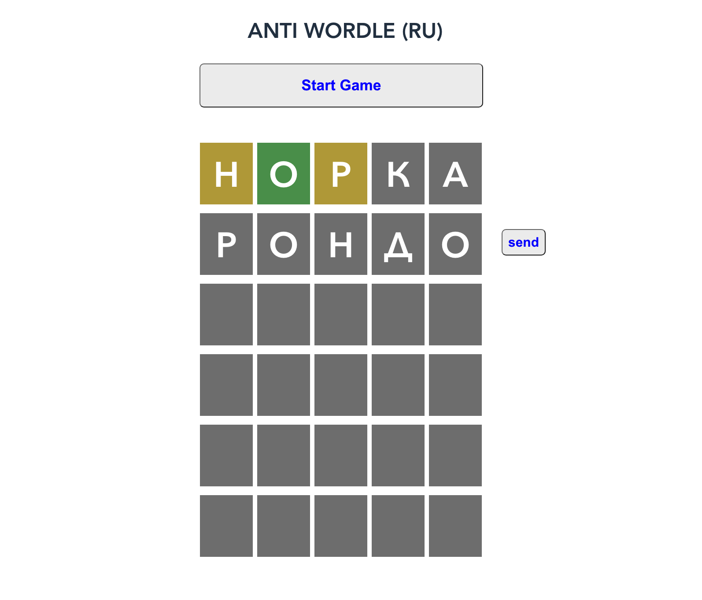

ANTI WORDLE
======================

This is reverse solution for word wide game Wordle. 

Program can find answer for any hidden word

Current statistics is 

 - 2 - 91
 - 3 - 1086
 - 4 - 1686
 - 5 - 554
 - 6 - 66
 - Average 3.83

## Run local
- server: standard Idea start RestBoot app
- client: from <b>ui </b> folder
- npm install
- npm run serve
- http://localhost:3000

## Run production 
- npm install
- copy /ui/dist to src/resources/ui

